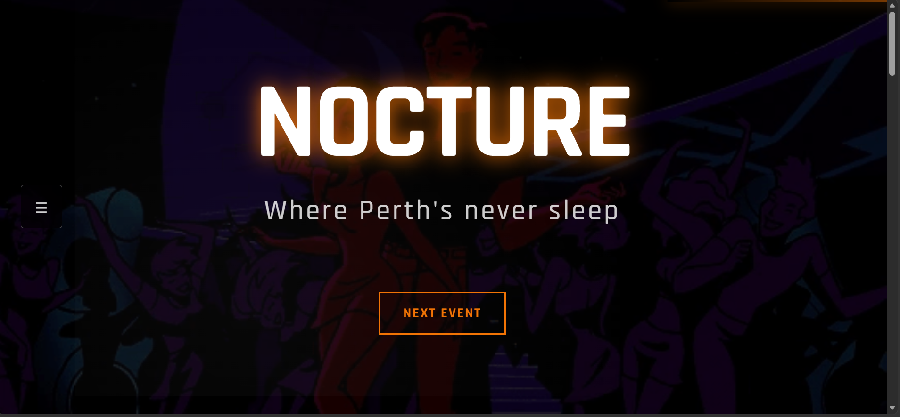
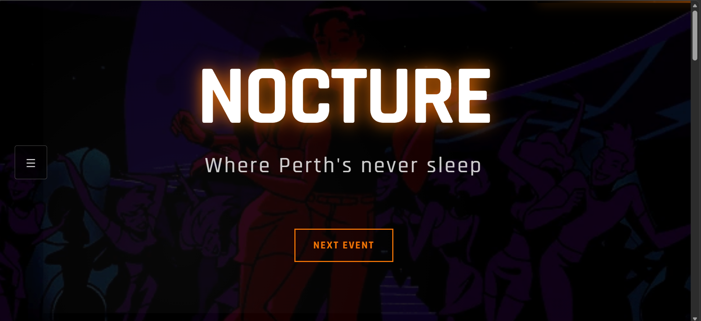
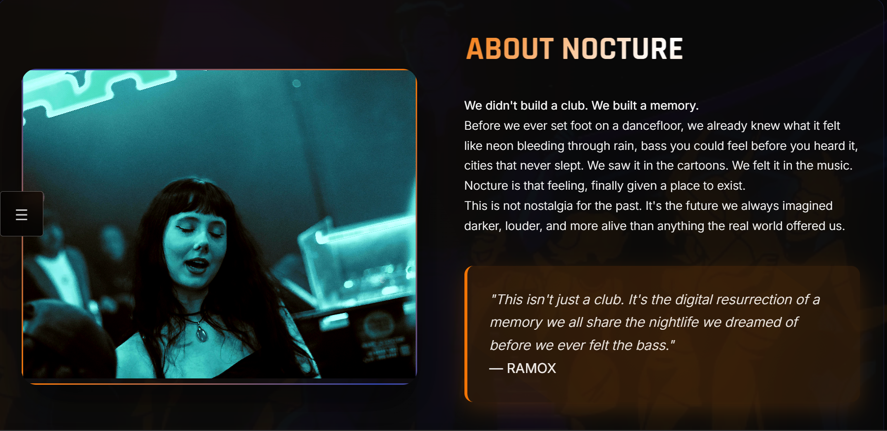
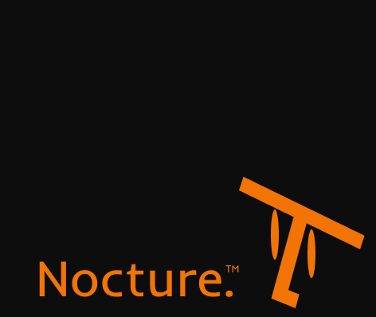

<div align="center">



# NOCTURE CLUB
### Fictitious Client Project — Nightclub Landing Page

[](https://developer.mozilla.org/en-US/docs/Web/HTML)
[](https://developer.mozilla.org/en-US/docs/Web/CSS)
[](https://developer.mozilla.org/en-US/docs/Web/JavaScript)
[](https://formspree.io)
[](https://pages.github.com)

**[→ Live Demo](https://math2034.github.io/Nocture/)**

</div>

---

## 📌 About The Project

Nocture Club is a fictitious client project — a landing page designed for an underground nightclub with a strong visual identity inspired by **early 2000s animated worlds** such as *Batman Beyond* and *Teen Titans*.

The goal was not to build a purely functional website, but to **recreate a feeling** the imagined version of nightlife we carried before ever experiencing it in real life.

> *"This isn't just a club. It's the digital resurrection of a memory we all share the nightlife we dreamed of before we ever felt the bass."*
> — RAMOX

---

## 🖥️ Preview

<!-- Adiciona 2 ou 3 screenshots do site -->
| Hero | About |
|------|-------|
|  |  |

---

## ✨ Features

- Fullscreen GIF background with overlay
- Optional ambient sound toggle
- Animated side navigation
- Upcoming events section
- Auto-advancing image slideshow
- Contact form via Formspree
- Smooth scroll navigation
- Fully responsive layout

---

## 🎨 Design Decisions

### Color System

| Color | Hex | Usage |
|-------|-----|-------|
| Near Black | `#0D0D0D` | Base background |
| Deep Blue | `#010440` | Depth and atmosphere |
| Electric Blue | `#3243A6` | Futuristic accents |
| Neon Orange | `#F27405` | Primary accent, CTAs |

### Typography
- **Inter** — body text, clean and modern
- **Rajdhani** — headings and UI elements, bold and urban

### Visual Inspiration
Scenes from *Batman Beyond* — futuristic cities, neon lighting, crowded dancefloors, shaped every design decision: dark backgrounds, high contrast, and motion throughout.

---

## 📁 Project Structure
nocture-club/
├── index.html
├── css/
│   └── style.css
├── js/
│   └── main.js
├── video/
│   └── club.gif
└── img/
├── logo1.png
├── alive.jpg
└── ...

---

## 🚀 Getting Started

No dependencies, no build tools. Just clone and open.

```bash
git clone https://github.com/Math2034/Nocture.git
cd Nocture
```

Then open `index.html` in your browser — or use Live Server if you're on VS Code.

---

## 📬 Contact Form

Form submissions are handled by **Formspree** — no backend required. To connect to your own email, replace the form action with your Formspree endpoint:

```html
<form action="https://formspree.io/f/your-id" method="POST">
```

---

## 📄 License

This is a fictitious project built for portfolio purposes. All content including brand name, events, and copy  is fictional.

---

<div align="center">
  <br><br>
  <sub>Designed & developed by <a href="https://github.com/Math2034">Matheus</a> · 2026</sub>
</div>
